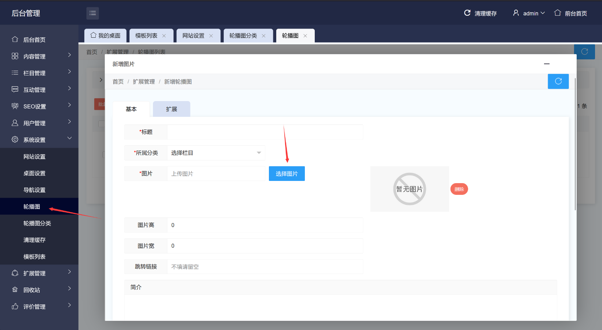
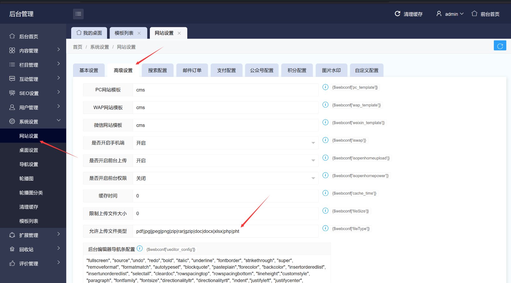
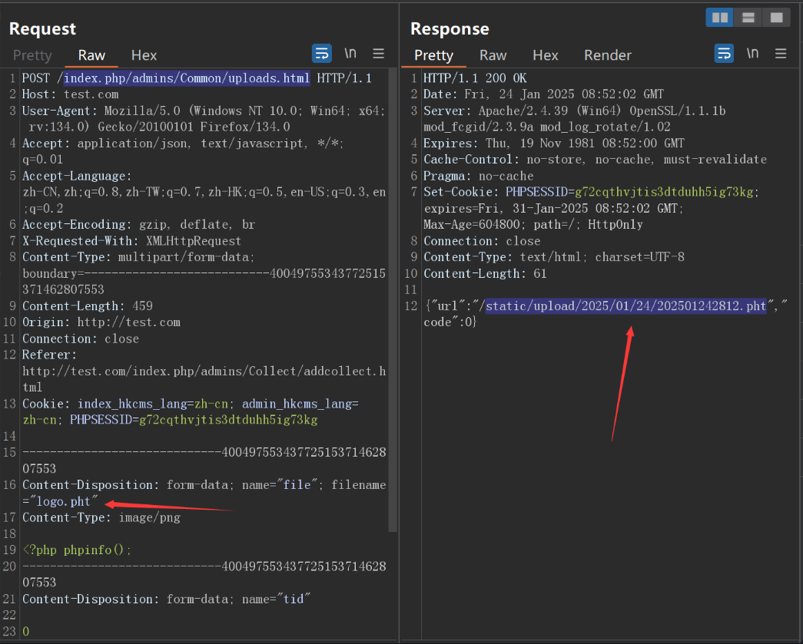
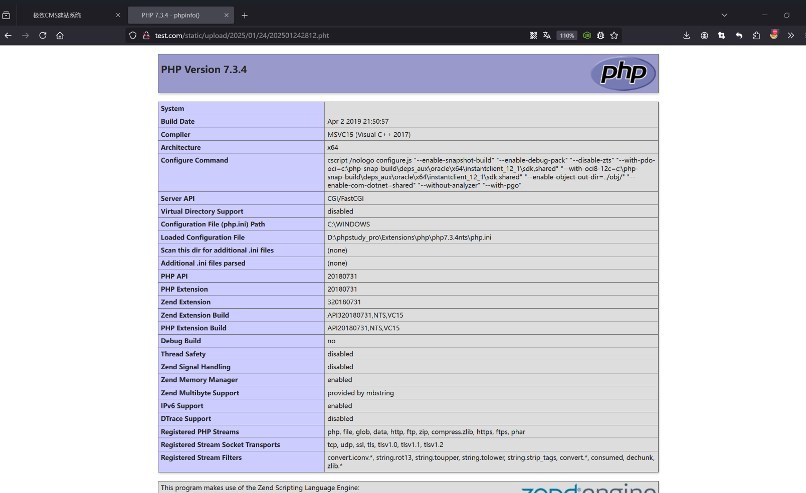

## Jihicms<=v2.5.4  File Upload RCE

### Debugging and Analysis

The system settings allow uploading image capture packets.


The code path is located at `index.php/admins/Common/uploads.html`
```php
function uploads()
	{
		if ($_FILES["file"]["error"] > 0) {
			$data['error'] =  "Error: " . $_FILES["file"]["error"];
			$data['code'] = 1000;
		} else {
			$pix = explode('.', $_FILES['file']['name']);
			$pix = end($pix);


			$fileType = $this->webconf['fileType'];
			if (strpos($fileType, strtolower($pix)) === false) {
				echo 1;
			}
			if (stripos($pix, 'php') !== false) {
				echo 1;
			}
			if (stripos($pix, 'phtml') !== false) {
				echo 1;
			}
			if (strpos($fileType, strtolower($pix)) === false   || stripos($pix, 'php') !== false || stripos($pix, 'phtml') !== false) {
				$data['error'] =  "Error: " . JZLANG("File type not allowed for upload!");
				$data['code'] = 1002;
				JsonReturn($data);
			}
```
It was found that a blacklist filters the `php` and `phtml` file extensions, and the file extension must also be within the website’s whitelist:
```
$fileType = $this->webconf['fileType'];
```

However, based on the Debian and Ubuntu's default Apache parsing rules after installation via `apt-get`, the configuration looks like this:
```r
<FilesMatch ".+\.ph(p[3457]?|t|tml)$">
	  SetHandler application/x-httpd-php
<FilesMatch>
```
This means that it is still possible to bypass the restriction using the `.pht` extension.

Therefore, by setting the website’s whitelist functionality and using the `.pht` extension, the blacklist can be bypassed, allowing file upload and RCE.

### Exploitation of Vulnerability

The website settings allow configuration of permitted file types.


Uploading an image capture packet in the system settings.


The access path successfully parses the PHP code.
```r
static/upload/2025/01/24/202501242812.pht
```
